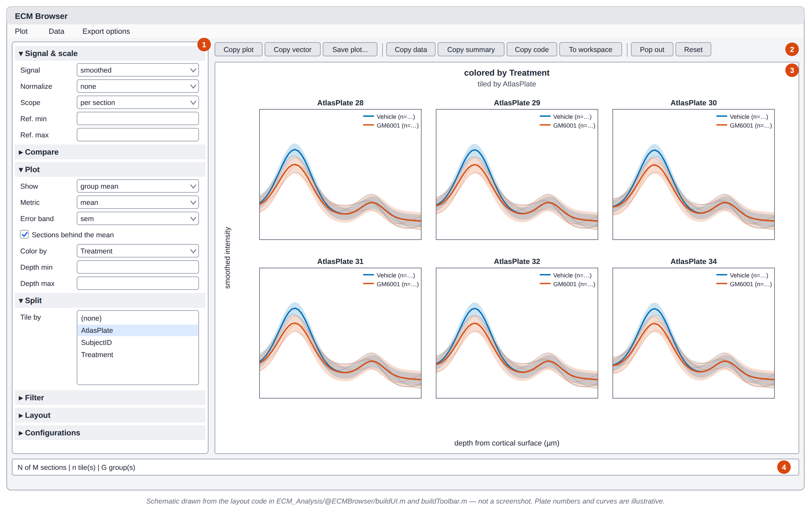

# ECM Analysis

`ECM_Analysis/` turns the profiles exported from the [Histology Browser](Histology-Browser) into
group comparisons. There are two paths:

- **Interactive, in MATLAB:** `ecm_prepare_analysis_data` aligns, smooths and grids the profiles.
  `ECMBrowser` then plots them by group, with filtering, normalization, comparisons and export.
- **Statistics, in R:** `ecm_export_for_r` writes flat CSVs, and `ecm_analysis.R` fits
  mixed-effects models and writes an HTML report.

`ECM_Analysis/S_ECManalysis.m` is a worked example of the whole chain for the GM6001 project.

## Step 1: Get a table of profiles

In the browser, select the sections you want and choose **Dataset > Export Selection to
Workspace...**. The default variable name is `histology`. Save it:

```matlab
save("histology_profiles.mat", "histology")
```

**Adding experiment metadata (optional).** Join your own columns, such as treatment or sex, onto
the table by `SubjectID` and `Hemisphere` with `outerjoin`. See the "attach project info" cell of
`S_ECManalysis.m` for an example that assigns drug and vehicle per hemisphere and computes
`CannulaDist`.

## Step 2: Prepare the data

```matlab
A = ecm_prepare_analysis_data(histology, ...
    fileVar = "ImagePath", ...
    groupVars = ["SubjectID", "AtlasPlate", "Treatment"], ...
    smoothingMethod = "gaussian", smoothingWindow = 25);
```

For each profile, this:

1. drops non-finite samples;
2. smooths with `smoothdata`;
3. finds the cortical surface and re-expresses distance as **depth from the surface**;
4. trims to `depthRange`;
5. optionally normalizes;
6. finds the peak;
7. interpolates everything onto a common depth grid.

> **The browser's surface mark is used where there is one.** `ecm_prepare_analysis_data` reads
> the `SurfaceOffset` and `RoiLength` columns of the browser export and places the mark on the
> profile's distance axis (`ecm_surface_distance`). Only a section with no mark has its surface
> detected with `surfaceMode`. `A.peaks.SurfaceMethod` says which happened for each section.

| Option | Default | Meaning |
|---|---|---|
| `fileVar` | first of `Stem`, `ImagePath`, `Filename`, `SourceFilePath`, `FilePath` | What identifies one profile |
| `groupVars` | `["SubjectID","AtlasPlate","Hemisphere"]` | Grouping for `A.grouped` |
| `keepVars` | `"all"` | Section columns copied onto each sample |
| `surfaceMarks` | `"prefer"` | `prefer`: align on the browser's mark, and detect with `surfaceMode` only where there is none. `only`: align on the mark, and hand unmarked sections to `surfaceFallback`. `ignore`: detect every surface. |
| `surfaceMarkVar` / `lineLengthVar` | `"SurfaceOffset"` / `"RoiLength"` | Where the mark and the line length are read from. Without `RoiLength`, the length between `RoiX1..RoiY2` is used. |
| `surfaceMode` | `"threshold"` | `threshold`: the last raw sample below `surfaceThreshold` in the search window. `fraction`: the first smoothed sample at or above min + thr·range. `gradient`: the steepest rise. `none`: no surface is detected. |
| `surfaceThreshold` | `1` | An intensity (for `threshold`) or a 0–1 fraction (for `fraction`) |
| `surfaceSearch` | `[0 500]` | Search window, measured from the first sample, in distance units |
| `surfaceFallback` | `"first"` | What to do when no surface is found: `first` (use the first sample), `none` (0), or `skip` (drop the profile) |
| `smoothingMethod` / `smoothingWindow` / `smoothingWindowUnit` | `"gaussian"` / `50` / `"samples"` | Passed to `smoothdata`. The unit can also be `"distance"`. |
| `normalizeMode` | `"none"` | `none`, `zscore`, `minmax` (per section) |
| `peakRange` / `peakSource` | `[0 Inf]` / `"smoothed"` | Where to look for the peak, and on which signal |
| `depthRange` | `[-Inf Inf]` | Depths kept |
| `binStep` | `0` | Depth bin size. `0` means the median sample spacing. |
| `errorMetric` | `"sem"` | `sem`, `std` or `ci95` for `A.grouped` |

**What comes back in `A`:**

- `A.aligned`: one row per sample.
- `A.peaks`: one row per section, with `SurfaceDistance`, `SurfaceFound`, `SurfaceMethod`, `PeakX`, `PeakY`.
- `A.grouped`: group × depth means.
- `A.grid`: depth × section matrices.
- `A.diagnostics`: per-profile `ok`, `skipped` or `error`, with a message. **Check this when
  sections seem to be missing.**

Distances stay in the units they were measured in: µm for calibrated images, pixels otherwise.

## Step 3: Explore in the ECM Browser

```matlab
B = launch_ecm_browser(A);
```



*Schematic generated from `@ECMBrowser/buildUI.m`; not a screenshot. Plate numbers and curves are
illustrative.*

### ① Control panel

Seven collapsible sections run down the left side. A closed section shows a one-line summary of
its settings.

| Section | Controls |
|---|---|
| **Signal & scale** | **Signal**: `smoothed` or `raw`. **Normalize**: `none`, `z-score`, `min-max`, `peak = 1`, `area = 1`, `subtract baseline`, `% of baseline`. **Scope**: which sections share one normalization (`per section`, `per group`, `per group in plot`, `within plot`, `across plots`). **Ref. min / Ref. max**: the depth window the normalization is computed from. |
| **Compare** | **Compare**: `none`, `difference`, `ratio`, `log2 ratio`, `% change`, `normalized difference`. **Compare by**: the field. **Reference**: a level, `(each vs. the rest)`, or `(every pair)`. **Pair within**: fields sections must share to be compared, such as subject and plate. |
| **Plot** | **Show**: `sections`, `group mean`, `peak summary`, `metric summary`. **Metric**, for metric summary (see below). **Error band**: `sem`, `std`, `ci95`, `bootstrap 95%`, `none`. **Sections behind the mean**. **Color by**. **Marker by** and **Line style by**: further fields whose values pick the marker or the line style within each color group; sections that differ on them are drawn and averaged apart, and a metric summary sets them side by side within the group's slot. **Depth min / max**. |
| **Split** | **Tile by**: one or more fields, giving one tile per combination (up to 64). |
| **Filter** | Pick a field, its values, and `keep` or `drop`, then combine conditions with `all (AND)` or `any (OR)`. The standing conditions are listed, with **Remove** and **Clear all**. |
| **Layout** | Legend placement, tile spacing, padding, tick labels, **Link axes**, **Transpose axes**. |
| **Configurations** | Save the current view by name and restore it later. Saved configurations persist between sessions. |

**Metrics** for `metric summary`, one value per section, computed on the curve as displayed:
`mean`, `median`, `integral`, `peak height`, `peak depth`, `peak1 - peak2 (height)`,
`peak1 to peak2 (depth)`, `FWHM`, `centroid depth`, `range (max - min)`, `variance`,
`std. dev.`, `coeff. of variation`, `slope`.

### ② Toolbar

| Button | Does |
|---|---|
| **Copy plot** / **Copy vector** | Clipboard image, or vector graphics |
| **Save plot...** | PNG, TIFF, JPEG, PDF, EPS, SVG or `.fig`, chosen by extension |
| **Copy data** | The drawn profiles, one column per section |
| **Copy summary** | A written account of every setting behind the view |
| **Copy code** | The commands that rebuild this view, ready to paste into a script |
| **To workspace** | The numbers behind the plot, as the variable `ECMview` |
| **Pop out** | Redraw the view in an ordinary figure |
| **Reset** | Restore the depth window, scale, comparison and filters. Color by, Marker by, Line style by and Tile by are left alone. |

The menus (**Plot**, **Data**, **Export options**) hold the same actions. They also let you save
data as `wide`, `long` or `sections` CSVs and set the export resolution (150–1200 dpi) and
background.

### ③ Plot grid

Right-click a curve, point or band to change that group's color, line style or marker. With a
**Marker by** or **Line style by** field set, the menu also offers each of that field's values, so
which hemisphere is dashed is still your choice. The legend lists those values in gray under the
color groups.

### ④ Status line

Shows how many sections are drawn, the number of tiles and groups, and any caveats. Typical
caveats are sections drawn unnormalized, sections with no comparison partner, or sections that
failed in preparation (see `A.diagnostics`).

### How normalization and comparison work

- **Normalization** is one map, `(y − center) / scale`. It is computed from the *smoothed* signal
  within the Ref. window, pooled over the sections in each Scope pool. Only sections that pass
  the filters count.
- **Comparisons** first group sections into matches: sections that share the **Pair within**
  fields, the tile, the color, the marker and the line style. Within a match, each side is
  averaged across its sections at
  each depth, and then the operation is applied (for example `a - b`).
- **Bootstrap 95%** resamples whole sections (2000 resamples, percentile CI). It needs the
  Statistics and Machine Learning Toolbox. Without it, the band is silently left out.

### Driving the browser from code

Everything in the panel can be set from the command line. The easiest way to get the commands is
**Copy code**, which gives you exactly the calls for the current view.

```matlab
B.setComparison("difference", "Treatment", reference = "Vehicle", within = "AtlasPlate");
B.setTiling("AtlasPlate");
B.setFilter("Condition", "Trained");
B.setFilter("AtlasPlate", ["28" "29" "30"]);      % values are given as text
B.setNormalization("% of baseline", [800 1500]);
B.DepthMinField.Value = 0; B.DepthMaxField.Value = 2000;
B.refresh();

B.savePlot("figure.pdf");
B.saveData("profiles.csv", Layout = "long");
v = B.viewData();                                % struct: depth, values, sections, metric, ...
B.setGroupStyle("Treatment", "GM6001", Color = [0.8 0.2 0.1], LineStyle = "--");

B.MarkerDropDown.Value = "Hemisphere";          % Marker by
B.LineStyleDropDown.Value = "Hemisphere";       % Line style by
B.refresh();
B.setGroupStyle("Hemisphere", "Right", Marker = "s", LineStyle = ":");
```

After setting a control's `.Value` directly, call `B.refresh()`.

## Statistics in R

```matlab
out = ecm_export_for_r("D:/Data/histology_full.mat", "D:/Data");
```

This writes two flat CSVs from the first table in the `.mat` file:

- `ECM Projects - GM6001 - profiles.csv`: one row per sample.
- `ECM Projects - GM6001 - sections.csv`: one row per section.

Both carry `SurfaceDistance`: the browser's surface mark on the `Distance` axis, placed the same
way `ecm_prepare_analysis_data` places it. It is `NaN` for a section with no mark. A table with
no `SurfaceOffset` column is refused, because R would have nothing to align on.

**These file names are fixed**, whatever your project is called.

`ecm_analysis.R` then fits, among others:

- a `lmer` model of peak intensity by treatment, with subject/hemisphere random effects and
  atlas-plate or cannula-distance covariates;
- a spline depth-profile model;
- deep-band models.

It writes `R_figures/ECM_GM6001_report.html` plus PNG figures.

> **The R script is project-specific.** It hard-codes `DATA_DIR <- "D:/GM6001_HISTOLOGY"` and the
> GM6001 file names and treatment levels (`Vehicle`, `GM6001`, `Control L`, `Control R`). It
> aligns on `SurfaceDistance` and does not detect the surface; sections without a mark are left
> out and listed in the report's QC. Its smoothing constants are set independently of the MATLAB
> call:
> - a 25-sample moving average;
> - 25 µm bins.
>
> Keep them in sync by hand. The script reads `IncludeInAnalysis` but does not filter on it.

Required packages: `readr`, `dplyr`, `tidyr`, `ggplot2`, `scales`, `lme4`, `lmerTest`, `emmeans`,
plus `splines` from base R.
