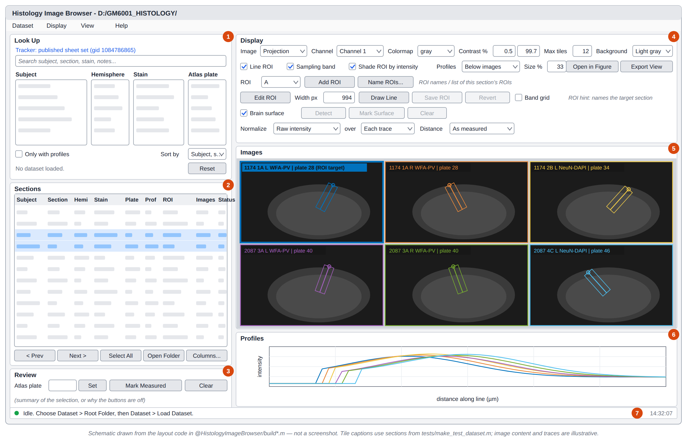

# Getting Started

## 1. Get the code

```bash
git clone https://github.com/dstolz/histology_analysis.git c:/src/histology_analysis
```

## 2. Put it on the MATLAB path

```matlab
addpath_nogit('c:/src/histology_analysis')
```

`addpath_nogit` adds the folder and every subfolder under it (`histology_browser/`,
`ECM_Analysis/`, `histology_browser/tests/`, and so on). It skips `.git`. Call it by full path
the first time, or `cd` into the repository first, because until it runs it isn't on the path
itself.

> **Note.** `addpath_nogit` skips any folder whose path *contains* `.git`, which includes
> `.github`. That doesn't matter for this repository. It would matter for a data folder with
> ".git" in its name.

To make this permanent, add the line to your `startup.m`, or use **Home > Set Path > Save**.

Only need the browser? `addpath('c:/src/histology_analysis/histology_browser')` is enough. Add
the folder that *contains* `@HistologyImageBrowser`, not the class folder itself.

## 3. Requirements

| What | Needed for | Notes |
|---|---|---|
| MATLAB, R2021a or newer | Everything | The code uses `Name = Value` call syntax, which R2021a introduced. |
| Image Processing Toolbox | Drawing and dragging ROIs, placing the brain surface mark, display downsampling in the browser; most of the [Image Processing Tools](Image-Processing-Tools) | Without it, the browser still opens, catalogs, displays and plots. Only ROI drawing and editing and surface placement are disabled. |
| [Bio-Formats for MATLAB](https://www.openmicroscopy.org/bio-formats/downloads/) (`bfmatlab`) | Showing raw `.czi` in the browser; `extract_czi_metadata`, `parseBfTiff`, `straighten_cortex*` | Optional for the browser. It finds `bfmatlab` automatically in any of these places: on the path, inside or beside this checkout, in `userpath`, or at the folder named by the `BFMATLAB_PATH` environment variable. |
| Statistics and Machine Learning Toolbox | The ECM app's **bootstrap 95%** error band | Optional. Without it that band is silently left out. |
| Fiji / ImageJ | Running `MACRO_Batch_LineMeasure.ijm` | Measuring happens in Fiji, not MATLAB. |
| R, with `readr dplyr tidyr ggplot2 scales lme4 lmerTest emmeans` | `ECM_Analysis/ecm_analysis.R` | `splines` ships with base R. The script stops with an `install.packages(...)` line if anything is missing. |

## 4. Five-minute tour, no data needed

The browser's test suite includes a generator for a small **synthetic dataset**: two subjects,
both hemispheres, two stains, plates 28–46, calibrated projections with Fiji ROI and profile
sidecars, and a section tracker CSV. Three sections are deliberately unfinished. It is
deterministic and about 220 KB.

```matlab
[root, trackerCsv] = make_test_dataset();          % writes to a temp folder
app = launch_histology_browser(root, metadataCSV = trackerCsv);
```

Things to try:

1. **Click a row** in the *Sections* table. The section's tile appears with its line ROI, its
   sampling band, and the profile below it.
2. **Shift- or Ctrl-click** a few more rows. Each section gets its own tile, and each tile's
   color matches its trace on the profile plot.
3. In *Look Up*, click `WFA-PV` under **Stain**. The table narrows to that stain. Press
   **Ctrl+Shift+R** to clear the filter.
4. Set **Distance** (bottom row of *Display*) to `Percent of line` and **Normalize** to
   `Min-max (0-1)`. This only rescales the plot; it doesn't change any files.
5. With a section selected, press **Ctrl+E** to edit its ROI. Drag an end, watch the badge
   change to `UNSAVED EDITS`, then press **Ctrl+Z** to revert.
6. Press **F1** for the full shortcut list.

When you're done, the dataset is just a folder under `tempdir`, so delete it whenever you like.



*Schematic of the browser window (generated from the layout code; not a screenshot). The numbered
areas are described on the [Histology Browser](Histology-Browser) page.*

## 5. Open your own data

```matlab
% Opens on the last folder used. Then choose Dataset > Root Folder and Dataset > Load Dataset.
launch_histology_browser()

% Or load immediately, with the tracker as a CSV export:
launch_histology_browser("D:/GM6001_HISTOLOGY/", ...
    metadataCSV = "D:/GM6001_HISTOLOGY/Trackers - Sections.csv")
```

The browser expects the folder layout that the Fiji macro produces; see
[Data Layout and File Formats](Data-Layout-and-File-Formats). For the Google Sheet options, see
[Section Tracker](Section-Tracker).

## 6. Run the tests (optional)

```matlab
test_histology_browser()                        % synthetic dataset; builds and deletes it
test_histology_browser("D:/GM6001_HISTOLOGY/")  % the same checks against real data
test_section_tracker()                          % Sheets tracker, against an in-memory sheet
```

The GUI tests drive a live browser window. They snapshot your saved browser preferences and
restore them afterwards.
