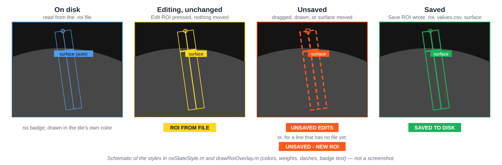

# Histology Browser

`HistologyImageBrowser` catalogs every section image under a root folder. It shows each section
with its Fiji line ROIs and their intensity profiles, and lets you correct ROIs, mark the brain
surface, and record review status.

```matlab
launch_histology_browser()                                   % last folder; then Dataset > Load Dataset
launch_histology_browser(root)                               % load now, no tracker
launch_histology_browser(root, metadataCSV = csvPath)        % tracker from a CSV export
launch_histology_browser(root, publishedUrl = pubUrl)        % tracker from a published Google Sheet
launch_histology_browser(root, sheetUrl = url, ...
    sheetCredentials = keyJson, sheetTab = "Sections")      % tracker over the Sheets API (read + write)
app = launch_histology_browser(...)                          % keep a handle to the app
```

If more than one tracker source is given, the order of preference is **Sheets API**, then
**published sheet**, then **CSV**. Only the first one set is used. See
[Section Tracker](Section-Tracker).

## The window


*Schematic generated from `@HistologyImageBrowser/build*.m`; not a screenshot. Tile captions use
sections from the synthetic test dataset, and the image content and traces are illustrative.*

The left **data column** (1–3) is for finding and reviewing sections. The right side (4–6) is for
looking at them. You can hide either part: **View > Show/Hide Data Column** (Ctrl+Shift+D),
**Show/Hide Display Row** (Ctrl+Shift+P), or both at once (Ctrl+H).

### 1 · Look Up: find sections

- **Search box.** Space-separated terms, and a row must match *every* term. It searches subject,
  section, stain and notes. Ctrl+F jumps here.
- **Subject / Hemisphere / Stain / Atlas plate lists.** Multi-select lists. Select none to
  include everything.
- **Only with profiles.** Hides sections that have no `*values.csv` yet.
- **Sort by.** `Subject, section`, `Atlas plate`, `Stain`, or `Status`.
- **Reset.** Clears every filter (Ctrl+Shift+R).
- **Tracker link** (above the search box). Appears when a tracker is configured and opens it.

### 2 · Sections: the catalog

This is one row per section. The default columns are Subject, Section, Hemi, Stain, Plate, Prof
(number of profiles), ROI, Images (renditions found), and Status. **Columns...** lets you choose
from all the fields the catalog carries. Columns are sortable by clicking the header, and your
choice is remembered.

**Status** is one of:

| Status | Meaning |
|---|---|
| `image + profile` | At least one profile was found. |
| `image only` | No profile yet. |
| `unparsed name` | The filename doesn't match the naming convention (see [Filename convention](Data-Layout-and-File-Formats#filename-convention)). |
| `no image` | A tracker row with no image on disk. |

Select one row to see it large. Shift- or Ctrl-click to compare several side by side, up to
**Max tiles** (default 12). The buttons:

- **< Prev / Next >** (Ctrl+Up / Ctrl+Down)
- **Select All** (Ctrl+A)
- **Open Folder** (Ctrl+Shift+F)

### 3 · Review: write to the tracker

Available only with the [Sheets API tracker](Section-Tracker#option-c-reading-and-writing-over-the-sheets-api).
It acts on **every selected section** at once.

- **Atlas plate** + **Set** (or Enter): writes the plate number. If the selected sections
  disagree, the field shows blank. Clearing the field empties the cell, after a confirmation.
- **Mark Measured / Clear**: sets or clears the `Measured` flag. **Ctrl+M** toggles: it marks
  until everything selected is marked, then clears.
- The line below the buttons summarizes the selection. When the panel is disabled, it says why:
  no sheet, no key file, no selection, or rows without a `Row UID`.

### 4 · Display: how sections are drawn

| Row | Controls |
|---|---|
| 1 | **Image**: `Projection`, `Mid plane`, `Composite`, `Raw`. **Channel**. **Colormap**: `gray`, `bone`, `hot`, `parula`, `turbo`, `green`, `magenta`. **Contrast %**: lower and upper percentile, default 0.5 and 99.7. **Max tiles** (12). **Background** of the image panel. |
| 2 | Overlays: **Line ROI**, **Sampling band**, **Shade ROI by intensity**. **Profiles**: where the profile plot sits (`Below images`, `Above images`, `Left of images`, `Right of images`, `Hidden`, `Profiles only`). **Size %**: the profile plot's share (default 33). **Open in Figure** (Ctrl+O). **Export View** (Ctrl+P). |
| 3 | **ROI** selector for sections with several ROIs. **Add ROI** (Ctrl+N). **Name ROIs...** |
| 4 | **Edit ROI** (Ctrl+E), **Width px**, **Draw Line** (Ctrl+D), **Save ROI** (Ctrl+S), **Revert** (Ctrl+Z), **Band grid**. |
| 5 | **Brain surface** overlay, **Detect** (Ctrl+B), **Mark Surface** (Ctrl+Shift+B), **Clear**. |
| 6 | **Normalize** and **over** (`Each trace` / `All traces`). **Distance**: `As measured`, `From line start`, `Percent of line`, `From brain surface`. |

Everything in this panel is also in the **Display** menu, so you can hide the panel (Ctrl+Shift+P)
without losing any control.

### 5 · Images: one tile per selected section

Each tile has a **color**. The frame, the ROI line, the label, and that section's trace on the
profile plot all share it, so you can match a picture to its curve at a glance.

- **Label** (top left): `<subject> <section> <hemi> <stain> | plate <n>`. The subject's
  `SUBJ-ID-` prefix is dropped. The plate reads `n/a` when the tracker has none.
- **Line ROI**: a circle marks the start point. The **sampling band** around it shows the width
  the profile averages over.
- **ROI target**: the tile that ROI buttons act on has a heavier frame and a filled label ending
  in `(ROI target)`. Click any tile to make it the target. This doesn't change the selection.
- **Right-click** any part of a tile for a menu:
  - rendition, channel, colormap and background;
  - the overlay switches;
  - **Edit ROI**, **Draw Line**, **Open Containing Folder**, **Open in Figure** and
    **Export View**.

  The per-tile items act on the tile you clicked.

### 6 · Profiles: intensity along each line

- Distance along the line is on x (µm when the image is calibrated) and intensity is on y.
- One trace per ROI, colored like its tile.
- Right-click for the placement and scaling options.

**Normalize** changes the plot only. The files, and the numbers from **Export to Workspace**,
stay in the units they were measured in.

| Normalize | Each sample becomes |
|---|---|
| Raw intensity | unchanged |
| Baseline subtracted | `y - min` |
| Min-max (0-1) | `(y - min) / (max - min)` |
| Percent of max | `100 * y / max` |
| Fold of mean | `y / mean` |
| Z-score | `(y - mean) / sd` |

**over** decides where `min`, `max`, `mean` and `sd` come from:

- **Each trace** takes them from the trace itself. Each profile's shape becomes easy to read,
  but you lose the brightness differences between sections.
- **All traces** takes one set from every trace on the plot, which keeps those differences.

**Distance** rescales the x axis, per trace:

- **From line start**: distance from the line's first sample.
- **Percent of line**: every line runs from 0 to 100.
- **From brain surface**: each trace's own surface mark is at 0. Traces without a mark keep
  their line-start axis, and the plot says how many there were.

### 7 · Status bar

The latest message, with a glyph for its kind and the time. It names which tracker source a load
used and reports any guard that stopped an action. For example, an action that needs a selection
tells you to select something.

## Editing line ROIs



*How an ROI looks in each save state (from `roiStateStyle.m`; schematic, not a screenshot).*

1. **Choose the section.** Click its tile to make it the ROI target, and choose the ROI in the
   **ROI** dropdown if it has several.
2. **Edit ROI** (Ctrl+E) puts draggable handles on the line. Drag either end or the whole line.
   **Draw Line** (Ctrl+D) replaces the line with one you drag out, at the **Width px** width.
3. **Nothing is written until you press Save ROI** (Ctrl+S). Saving:
   - rewrites the `.roi`;
   - **remeasures** the `*values.csv` from the full-resolution projection;
   - writes or removes the brain-surface sidecar.
4. **Revert** (Ctrl+Z) returns to what's on disk. **Esc** leaves editing.
5. **Unsaved edits are safe.** If you move to another section with unsaved changes, the browser
   asks before discarding them.

To measure a **second region** on the same section, select just that section and use **Add ROI**
(Ctrl+N). Ctrl+Shift+N cycles
through a section's ROIs. **Name ROIs...** gives the keys readable names, such as A = `ACx` and
B = `S1`. The names show on overlays, legends, the dropdown and the catalog.

## Marking the brain surface

Profiles are only comparable across sections when they are aligned to the pial surface. The
surface is stored as **one number per ROI**: the distance along the line from its start point,
saved in `<roi>_surface.json` beside the `.roi` (see
[File formats](Data-Layout-and-File-Formats#_roi_surfacejson-the-brain-surface-mark)).

- **Detect** (Ctrl+B) finds the step from background into tissue. It smooths the trace, splits it
  at Otsu's threshold, and walks in from the background end until the trace crosses and stays
  across.
  - It **refuses** traces that only slope, lines that lie entirely in tissue, and lines with
    tissue at both ends.
  - It flags a weak step as low confidence.
  - It runs automatically when you draw a new line.
  - It does *not* run when you open an existing ROI for editing.
- **Mark Surface** (Ctrl+Shift+B): click on the image. The point is projected onto the line.
- **Drag** the mark to adjust it. It slides along the line.
- **Clear** removes it. That is the right choice when the edge can't be told from the
  background: an unmarked trace is visibly unaligned, while a wrong mark would silently shift it.

Detected marks are labelled `surface (auto)` on the tile, and marks you placed or adjusted are
labelled `surface`. So a grid of tiles shows which sections you have checked. **Brain surface**
(Ctrl+4) toggles the marks.

## Exporting

| Action | Result |
|---|---|
| **Dataset > Export Selection to Workspace...** (Ctrl+Shift+E) | A table in the base workspace (default name `histology`), with **one row per ROI** of each selected section. |
| **Export View** (Ctrl+P) | The current tiles and plot, saved to an image file. |
| **Open in Figure** (Ctrl+O) | The current view redrawn in an ordinary MATLAB figure, which you can edit further. |

The exported table contains:

- **Name tokens:** `Stem`, `SubjectID`, `SampleID`, `SectionID`, `Hemisphere`, `Stain`,
  `ZPlane`, `DateCode`, `ImageNumber`, `Protocol`, `Series`, `NameParsed`.
- **ROI identity:** `ROIKey` (the letter on disk) and `ROIName` (your display name).
- **Files:** `Folder`, `Variant`, `ImagePath`, `RoiPath`, `ValuesPaths`, `NProfiles`.
- **Tracker:** `Status`, `InTracker`, `AtlasPlate`, `Content`, `Slide`, `SliceID`, `ImageDate`,
  `LaserPower`, `ProcessingID`, `Notes`.
- **Geometry, in pixels:** `RoiState`, `RoiX1`, `RoiY1`, `RoiX2`, `RoiY2`, `RoiWidth`,
  `RoiLength`, `SurfaceOffset`, `SurfaceX`, `SurfaceY`, `SurfaceSource`, `PixelSize`,
  `PixelUnit`.
- **Profile:** `ROILabel`, `ProfileSource`, `NSamples`, and `Profile`. `Profile` is a cell per
  row holding a two-column table (`Distance`, `Intensity`).

An unsaved edit exports as the line you see on screen. A section with no ROI still gets one row,
with NaN coordinates and `RoiState` `none`.

## Menus

| Menu | What's there |
|---|---|
| **Dataset** | Root Folder, Tracker CSV, Filename Pattern, Published Sheet, Google Sheet Tracker (Configure..., Prepare Sheet for Writing..., Clear), Load Dataset (Ctrl+L), Export Selection to Workspace... (Ctrl+Shift+E) |
| **Display** | Mirrors every control in the Display panel, including ROI Editing |
| **View** | Show/Hide Data Column, Show/Hide Display Row, Show/Hide All |
| **Help** | Keyboard Shortcuts (F1), Gerbil Atlas Explorer, Report a Bug..., Request a Feature... |

## Preferences

Window position and size, display settings, catalog columns and sort order, filename pattern,
ROI names, and tracker settings are all remembered between sessions. They are stored in the
MATLAB preference group `HistologyImageBrowser`.

- The key file for the Sheets API is stored **by path only**. Its contents are never copied.
- If the saved window position is on a monitor that's no longer attached, it is discarded.

To start fresh: `rmpref("HistologyImageBrowser")`.

## Speed notes

- **Overlay toggles and ROI edits redraw only what changed.** Line, band, shading, grid,
  dragging and saving update in place.
- **Pixel changes rebuild the whole grid.** That covers rendition, channel, colormap, contrast,
  Max tiles and background.
- **Large selections:** keep **Max tiles** modest.
