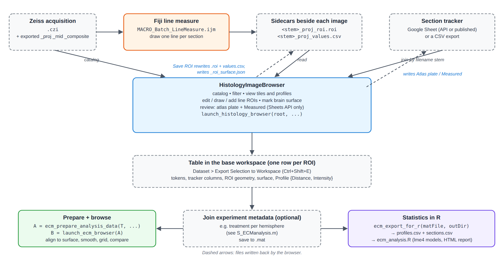

# histology_analysis

MATLAB tools for working with histology section images. You can catalog sections, draw and
review the line profiles measured across cortex, align them to the brain surface, and compare
ECM staining across experimental groups. R handles the statistics.

## What's in the toolbox

| Component | What it's for | Start here |
|---|---|---|
| **Histology Image Browser** | Catalog every section image under a folder. Filter by subject, hemisphere, stain and atlas plate. See each section with its line ROI and intensity profile. Edit ROIs, mark the brain surface, and mark sections measured in the section tracker. | [Histology Browser](Histology-Browser) |
| **Section tracker** | The browser joins your lab's section tracker (a Google Sheet or a CSV) onto the catalog. It can also write "Measured" back to the tracker. | [Section Tracker](Section-Tracker) |
| **ECM Analysis app** | Take the exported profiles and align them to the cortical surface. Then smooth, normalize, tile, filter and compare groups interactively, and export figures, data and reproducible code. | [ECM Analysis](ECM-Analysis) |
| **R statistics** | `ecm_analysis.R` fits mixed-effects models to the exported profiles and writes an HTML report. | [ECM Analysis § Statistics in R](ECM-Analysis#statistics-in-r) |
| **Image tools** | Standalone utilities: CZI metadata extraction, interactive rotation, overlay and threshold tools, cortex straightening, and a crop labeller. | [Image Processing Tools](Image-Processing-Tools) |

## Where to go next

- **New here?** [Getting Started](Getting-Started) covers installation, requirements, and a
  five-minute tour on a synthetic dataset that ships with the code, so you don't need any real
  data to try it.
- **Want to get something done?** [Recipes](Recipes) has step-by-step instructions for common
  tasks.
- **Looking for a key?** [Keyboard Shortcuts](Keyboard-Shortcuts).
- **Something not working?** [Troubleshooting and FAQ](Troubleshooting-and-FAQ).

## Typical workflow

1. **Acquire and export.** Each section is imaged (Zeiss `.czi`). Projections (`_proj.tif`) and
   optional mid-plane (`_mid`) and composite (`_composite`) renditions are exported beside it.
2. **Measure and review in MATLAB.** `launch_histology_browser("D:/MyHistology/", ...)` catalogs
   everything and joins it with the section tracker. Here you can:
   - draw, redraw or add line ROIs;
   - check each line;
   - mark the brain surface;
   - tick sections off as measured.
3. **Export.** Select sections and choose **Dataset > Export Selection to Workspace**. You get
   a table with one row per ROI, and each row carries its profile.
4. **Analyze.** Run `ecm_prepare_analysis_data` and then `launch_ecm_browser` to explore
   interactively. Or run `ecm_export_for_r` and then `ecm_analysis.R` for the statistics.

## About the pictures in this wiki

The window images here are **schematics generated from the layout code, not screenshots**. They
are drawn from the same grid sizes, labels and defaults that the `buildUI.m` files set. The
images and profile traces inside them are illustrative, not data.

## Editing this wiki

The wiki's source lives in the main repository under
[`docs/wiki/`](https://github.com/dstolz/histology_analysis/tree/main/docs/wiki). A workflow
(`.github/workflows/wiki.yml`) publishes it here on every push to `main` that touches that
folder. **Edit the files there, not on this site**: direct edits here are overwritten by the next
sync.

The SVG sources sit beside the PNGs in `docs/wiki/images/`, and the Node scripts that generate
them are in `docs/wiki/images/src/`. To replace a schematic with a real screenshot, add the PNG
under `docs/wiki/images/` and point the page at it.

## Repository

Source: <https://github.com/dstolz/histology_analysis>.

For bug reports and feature requests, use the browser's **Help > Report a Bug...** and
**Help > Request a Feature...**. Each one opens a prefilled issue there. See
[Troubleshooting and FAQ](Troubleshooting-and-FAQ#reporting-a-problem).
